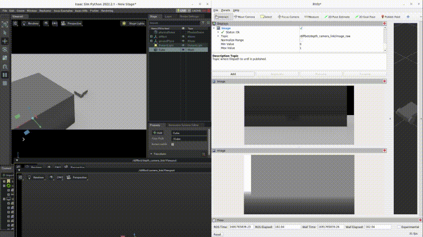
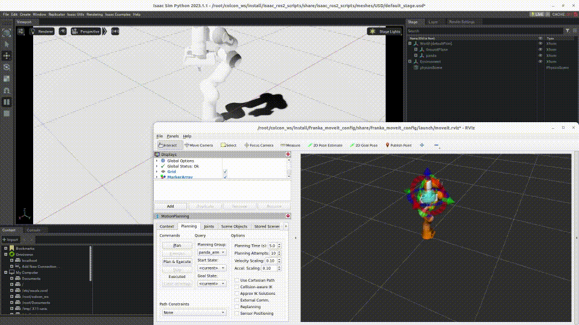

# isaac-ros2-control-sample
- ros2_control Demo
  
- LiDAR output Demo
  
- Camera output Demo
  
- Arm robot Demo
  

This repository shows how to control the robot from ros2_control to make Isaac Sim easier to use.
Important packages are "topic_based_ros2_control" and "isaac_ros2_scripts". 
"topic_based_ros2_control" provide hardware_interface class and send the commands from ros2_control to "isaac_ros2_scripts".
"isaac_ros2_scripts" is needed bacause Isaac Sim needs specific python environment.
"isaac_ros2_scripts" has the python script to launch and control Isaac Sim.

The features of this repository are below:
- This shows how to control a robot on Isaac Sim with ros2_control.
- This provides a Dockerfile where Isaac Sim and ROS 2 Jazzy can coexist.
- This currently supports prismatic and rotational joints using position and velocity control.
- This sends joint status (position, velocity and effort) to ros2_control from Isaac Sim.
- This launches sensors from URDF description.
- This spawns URDF model at the desired timing and position.
- This launchs sensors and controller at the desired timing.
- This sets stiffness, damping and friction from URDF description.

## Supported Versions

| Branch / Tag | Isaac Sim | ROS 2 |
|----|----|----|
| `main` | 6.0.1 | Jazzy |

For Isaac Sim 5.x, use the commit tagged before the Isaac Sim 6 migration
(`d03e96e` and earlier).

## Prerequisite
1. Docker
1. Isaac Sim Docker Image (Tested using image based on nvcr.io/nvidia/isaac-sim:6.0.1)
1. NVIDIA Driver 575 or later

> [!IMPORTANT]
> Isaac Sim 6 is built with CUDA 12.9. With older host drivers (e.g. 555),
> most features appear to work but the RTX LiDAR silently publishes no data
> (`CUDA Driver CALL FAILED ... the provided PTX was compiled with an
> unsupported toolchain.` appears in the log). Upgrade the host driver to
> 575 or later.

## How to use
1. Install Docker and pull Isaac Sim Docker Image.
   refer to https://docs.omniverse.nvidia.com/app_isaacsim/app_isaacsim/install_container.html

2. Clone the repo to your ros2 workspace
   ```bash
   git clone https://github.com/hijimasa/isaac-ros2-control-sample.git
   ```

3. Get git submodules
   ```bash
   cd isaac-ros2-control-sample
   git submodule update --init --recursive
   ```

4. Build a docker image with shell script.
   ```bash
   cd docker
   ./build_docker_image.sh
   ```

5. Launch a docker container
   ```bash
   ./launch_docker.sh
   ```

6. Build ros2 source codes
   ```bash
   colcon build && source install/setup.sh
   ```

7. Launch the package

   7.1. For Mobile Robot
   - To launch simulator
   ```bash
   ros2 run isaac_ros2_scripts launcher
   ```

   - To spawn robot (another terminal)
   ```bash
   docker exec -it isaac-sim /bin/bash
   ros2 launch isaac_diffbot_sim diffbot_spawn.launch.py
   ```

   - To launch teleop_twist_keyboard (another terminal)
   ```bash
   docker exec -it isaac-sim /bin/bash
   ros2 run teleop_twist_keyboard teleop_twist_keyboard
   ```
   7.2. For Arm Robot
   - To launch simulator
   ```bash
   ros2 run isaac_ros2_scripts launcher
   ```

   - To spawn robot (another terminal)
   ```bash
   docker exec -it isaac-sim /bin/bash
   ros2 launch franka_moveit_config demo.launch.py 
   ```

> [!NOTE]
> For the first time, launching Isaac Sim takes a very long time.
> Isaac Sim must be fully launched to spawn the robot.

## Next
You can make URDF for Isaac Sim with [this documentation](https://hijimasa.github.io/isaac_ros2_utils/).

## Migration notes for Isaac Sim 6

- JSON LiDAR profiles (`lidar_configs/*.json`) were removed from Isaac Sim.
  LiDARs are now USD sensor assets resolved by name. Set the `<config>` tag in
  your URDF to one of the supported names (e.g. `Example_Rotary`,
  `Example_Rotary_2D`, `SICK_TIM781`, `RPLIDAR_S2E`, `OS1`, `HESAI_XT32_SD10`).
  Unsupported names (including the old Hokuyo configs) automatically fall back
  to `Example_Rotary_2D` / `Example_Rotary` with a warning listing all
  supported names.
- The URDF importer was rewritten in Isaac Sim 6. Spawned robots now place
  links under `/<robot>/Geometry/` and joints under `/<robot>/Physics/`, so
  topic names derived from prim paths change accordingly (e.g.
  `/diffbot/Geometry/base_link/lidar_link/scan`).

## Bug
- LaserScan topic do not published when 2D Lidar config file is used.
- You should uncheck "Normarize Image" in your depth topic in RViz2 if you get black depth image.
