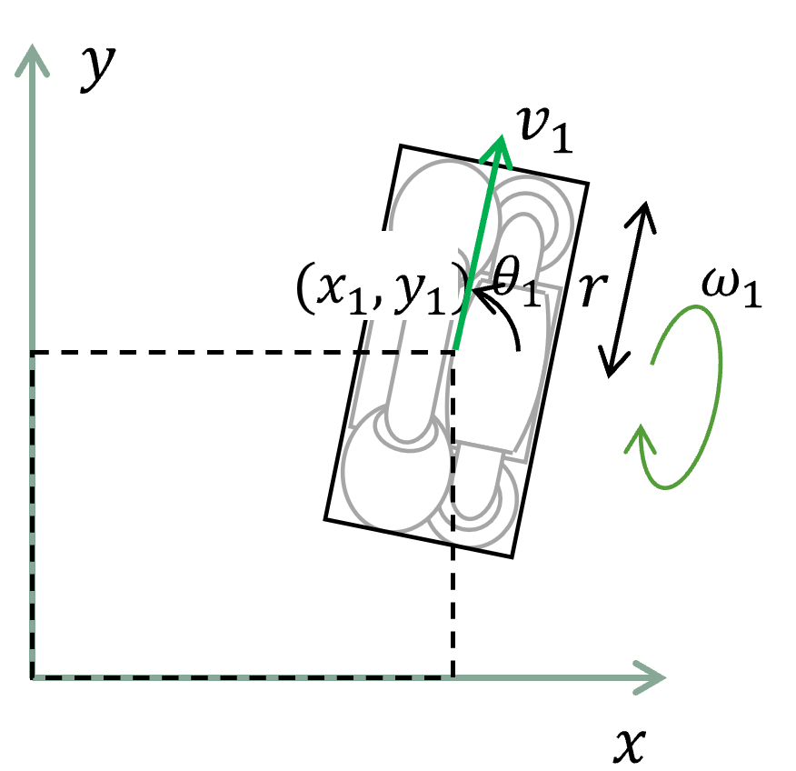

# omni_wheel_controller
Omni wheel controllers to accompany ros2_control (unofficial)
This package is based on diff_drive_controller.

- This package checked in docker "ros:humble" image. Sample code is [here](https://github.com/hijimasa/omni_wheel_controller_sample).

# Overview

Controller for omni wheel robot. Control is in the form of a velocity command, that is split then sent on the  wheels of a omni wheel robot. Odometry is computed from the feedback from the hardware, and published.

## Velocity commands

The controller works with a velocity twist from which it extracts the x component of the linear velocity and the z component of the angular velocity. Velocities on other components are ignored.

## Hardware interface type

The controller works with wheel joints through a velocity interface.

## Other features

- Realtime-safe implementation.
- Odometry publishing
- Task-space velocity, acceleration and jerk limits
- Automatic stop after command time-out 

## Mathematical Background
The illustration on the below shows the pattern diagram of one wheel in the Omni wheel robot.

In this diagram, the following notation applies. 

- $V$

  Robot's linear velocity 

- $\Omega$

  Robot's angular velocity

- $x_n, y_n$

  n-th omni wheel position.

- $l_n$

  Distance between n-th omni wheel and robot's center.
  $l_n = \sqrt{x_n^2+y_n^2}$
  This package expects same distance $l$.

- $r$
  Omni wheel's radius.

- $\theta_n$
  n-th omni wheel's direction
  In this package, the omniwheel is expected to be perpendicular to the direction vector from the center of the robot.

- $\omega_n$
  n-th omni wheel's velocity

This controller calculates the n-th omni wheel's velocity $\omega_n$ to:
$\omega_n = -\frac{1}{r}(V_x \cos{\theta_n} + V_y \sin{\theta_n} + \Omega l \sin{(\theta_n - \arctan{\frac{y_n}{x_n}})})$

# ROS API

## Description

The controller main input is a geometry_msgs::Twist topic in the namespace of the controller.

### Subscribed Topics

- cmd_vel ([geometry_msgs/Twist](http://docs.ros.org/en/api/geometry_msgs/html/msg/Twist.html))

  Velocity command. 

### Published Topics

- odom ([nav_msgs/Odometry](http://docs.ros.org/en/api/nav_msgs/html/msg/Odometry.html))

  Odometry computed from the hardware feedback. 

- /tf ([tf/tfMessage](http://docs.ros.org/en/api/tf/html/msg/tfMessage.html))

  Transform from odom to base_footprint 

- publish_cmd ([geometry_msgs/TwistStamped](http://docs.ros.org/en/api/geometry_msgs/html/msg/TwistStamped.html))

  Available when "publish_cmd" parameter is set to True. It is the Twist after limiters have been applied on the controller input. 

## Parameters
- omni_wheel_names (string | string[...])

  Omni wheel joint names list 

- omni_wheel_angle (double | double[...])

  Omni wheel direction $\theta_n$ list

- pose_covariance_diagonal (double[6])

  Diagonal of the covariance matrix for odometry pose publishing 

- twist_covariance_diagonal (double[6])

  Diagonal of the covariance matrix for odometry twist publishing 

- publish_rate (double, default: 50.0)

  Frequency (in Hz) at which the odometry is published. Used for both tf and odom 

- cmd_vel_timeout (double, default: 0.5)

  Allowed period (in s) allowed between two successive velocity commands. After this delay, a zero speed command will be sent to the wheels. 

- base_frame_id (string, default: base_link)

  Base frame_id, which is used to fill in the child_frame_id of the Odometry messages and TF. 

- linear/x/has_velocity_limits (bool, default: false)

  Whether the controller should limit linear speed or not. 

- linear/x/max_velocity (double)

  Maximum linear velocity (in m/s) 

- linear/x/min_velocity (double)

  Minimum linear velocity (in m/s). Setting this to 0.0 will disable backwards motion. When unspecified, -max_velocity is used. 

- linear/x/has_acceleration_limits (bool, default: false)

  Whether the controller should limit linear acceleration or not. 

- linear/x/max_acceleration (double)

    Maximum linear acceleration (in m/s^2) 

- linear/x/min_acceleration (double)

  Minimum linear acceleration (in m/s^2). When unspecified, -max_acceleration is used. 

- linear/x/has_jerk_limits (bool, default: false)

  Whether the controller should limit linear jerk or not. 

- linear/x/max_jerk (double)

  Maximum linear jerk (in m/s^3). 

- angular/z/has_velocity_limits (bool, default: false)

  Whether the controller should limit angular velocity or not. 

- angular/z/max_velocity (double)

  Maximum angular velocity (in rad/s) 

- angular/z/min_velocity (double)

  Minimum angular velocity (in rad/s). Setting this to 0.0 will disable counter-clockwise rotation. When unspecified, -max_velocity is used. 

- angular/z/has_acceleration_limits (bool, default: false)

  Whether the controller should limit angular acceleration or not. 

- angular/z/max_acceleration (double)

  Maximum angular acceleration (in rad/s^2) 

- angular/z/min_acceleration (double)

  Minimum angular acceleration (in rad/s^2). When unspecified, -max_acceleration is used. 

- angular/z/has_jerk_limits (bool, default: false)

  Whether the controller should limit angular jerk or not. 

- angular/z/max_jerk (double)

  Maximum angular jerk (in m/s^3). 

- enable_odom_tf (bool, default: true)

  Publish to TF directly or not 

- omni_wheel_distance (double)

    The distance between the wheel and robot's center $l$.
    It is expected they all have the same size.

- wheel_radius (double)

  Radius of the wheels $r$. It is expected they all have the same size.

- odom_frame_id (string, default: "/odom")

  Name of frame to publish odometry in. 

- publish_cmd (bool, default: False)

  Publish the velocity command to be executed. It is to monitor the effect of limiters on the controller input. 

- velocity_rolling_window_size (int, default: 10)

  The number of velocity samples to average together to compute the odometry twist.linear.x and twist.angular.z velocities 

## Controller configuration examples

### Minimal description
T.B.D.

### Complete description

```yaml
omni_wheel_controller:
  ros__parameters:
    omni_wheel_names  : ['wheel0_shaft_joint', 'wheel1_shaft_joint', 'wheel2_shaft_joint', 'wheel3_shaft_joint']
    omni_wheel_angle  : [0.785398, 2.356194, -2.356194, -0.785398]

    omni_wheel_distance : 0.49
    wheel_radius : 0.05

    odom_frame_id: odom
    base_frame_id: base_link

    pose_covariance_diagonal : [0.001, 0.001, 1000000.0, 1000000.0, 1000000.0, 1000.0]
    twist_covariance_diagonal: [0.001, 0.001, 1000000.0, 1000000.0, 1000000.0, 1000.0]

    enable_odom_tf: true

    cmd_vel_timeout: 3.0
    publish_limited_velocity: true
    velocity_rolling_window_size: 10

    # limits
    linear.x.has_velocity_limits: true
    linear.x.has_acceleration_limits: false
    linear.x.has_jerk_limits: false
    linear.x.max_velocity: 1.0
    linear.x.min_velocity: -1.0
    linear.x.max_acceleration: 0.4
    linear.x.min_acceleration: -0.4
    linear.x.max_jerk: 0.5
    linear.x.min_jerk: -0.5

    angular.z.has_velocity_limits: true
    angular.z.has_acceleration_limits: false
    angular.z.has_jerk_limits: false
    angular.z.max_velocity: 1.5
    angular.z.min_velocity: -1.5
    angular.z.max_acceleration: 0.8
    angular.z.min_acceleration: -0.8
    angular.z.max_jerk: 0.5
    angular.z.min_jerk: -0.5
```

## Note
"rcppmath/rolling_mean_accumulator.hpp" is added in rcpputils ver 2.2.0

"rcpputils/rolling_mean_accumulator.hpp" is added in rcpputils ver 2.6.0

Note that the files that can be included depend on the version of rcpputils.
